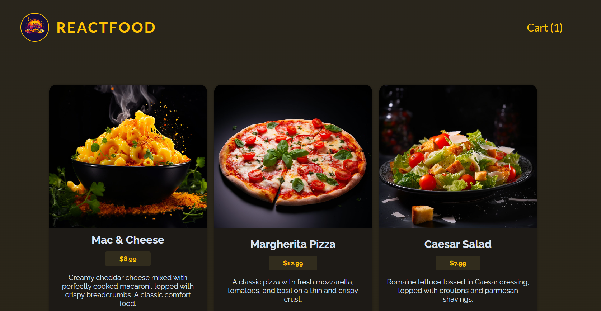

# 음식 주문 쇼핑몰 (학습용 프로젝트)
- 컨텍스트 API를 활용한 전역 상태 관리와 커스텀 훅을 통한 코드 간소화 및 재사용성을 증가시키는 법을 배울 수 있었다
- 프론트는 React, 백엔드는 Express를 사용하며, 풀스택 기반의 프로젝트를 통해 데이터 통신 흐름에 대해 보다 깊게 이해할 수 있었다.
- 자주 사용하는 컴포넌트 (버튼, 모달) 을 따로 UI 폴더에 넣어 재사용성을 증가시키는 방법을 터득할 수 있었다.

### 홈 화면
;

### 쇼핑 카트 화면
;
- 음식 항목 별로 add 버튼을 누르게 되면 장바구니에 담기며, 총 가격을 계산해준다.
- 수량 또한 원하는 대로 조절할 수 있는 버튼을 통해 항목 별 수량 조절 가능